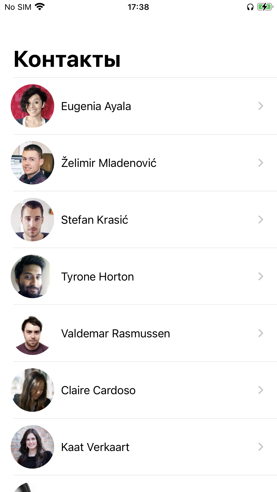
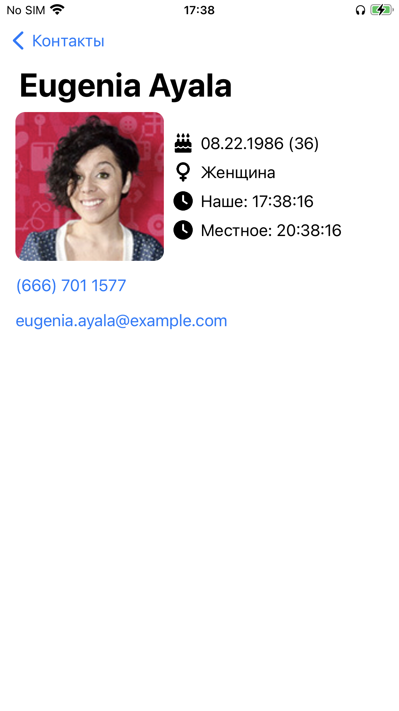
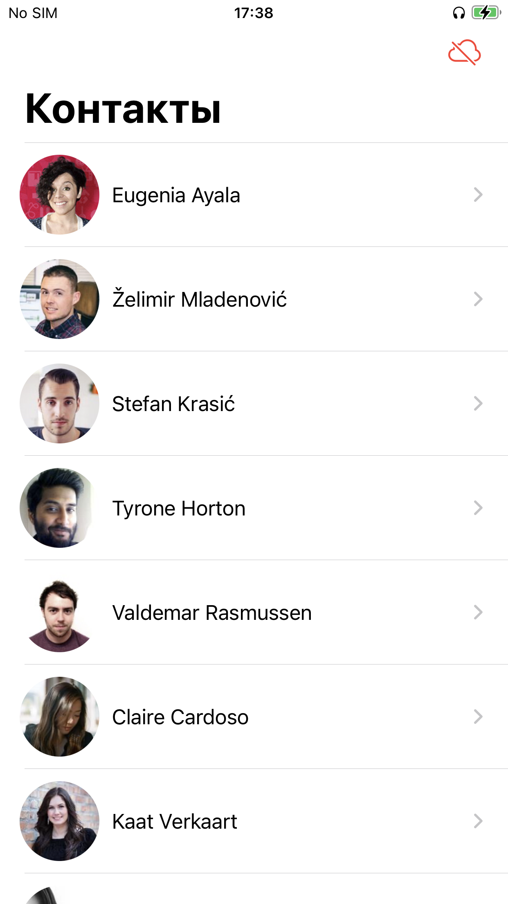
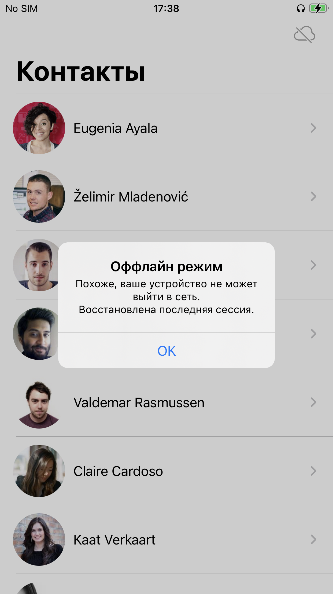

# Список контактов
Проложение для списка контактов

## Функциональные возможности
Приложение работает в двух режимах:
  1. Онлайн режим
  2. Оффлайн режим (отображение данных предыущей сессии)
### Онлайн режим
При наличии сети список будет бесконечно расширяться, кешируя изображения и сохраняя данные в БД
 
 

 

### Оффлайн режим
В случае отсутствия подключения к сети при запуске, приложение восстановит данные из предыдущий сессии из БД
 
 

 

При нажатии на изображение на детальном экране

## Внешние зависимости
В проект установлены pods:
- [Kingfisher](https://github.com/onevcat/Kingfisher)
- [SimpleImageViewer](https://github.com/LcTwisk/SimpleImageViewer)

### Установка pods
Команду `pod install` выпонлять не нужно, так как поды проиндексированы в репозитории.
Это сделано по той причине, что для устаревшей библиотеки (SimpleImageViewer) были внесены изменения вручную

### Дополнительно
Использованы иконки [Font-Awesome](https://github.com/FortAwesome/Font-Awesome)